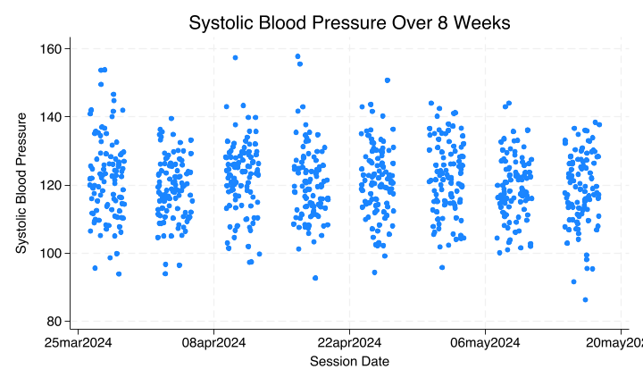

```stata
qui {


    //ChatGPT wrote this script following a few instructions from me
* I'll indicate with `*` the points I edited for it to work
//Very impressive since this was a first iteration

clear

// Set the number of students and sessions
local nstudents 100
local nsessions 8

// Create an empty dataset

set obs 8
gen student_id = .
gen session = .
gen sbp = .
gen session_date = .

// Loop over each student
forvalues i = 1/`nstudents' {
    // Generate data for each session for the current student
    forvalues j = 1/`nsessions' {
        // Generate student ID
        replace  student_id = `i'
        
        // Generate session
        replace session = `j'
        
        // Generate simulated systolic blood pressure measurements
        set seed `i'`j' // Set seed based on student and session
        replace sbp = rnormal(120, 10)
        
        // Append data for the current session to the dataset
		*append
		*ChatGPT included the "append" command with no additional syntax
    }
	*I inserted this line of code
	if c(os) == "MacOSX" {
        save student`i', replace  
    }
    else {
	    save student`i', replace  
    } 	
}

* ChatGPTs contribution ends at this point

clear 
forvalues i=1/`nstudents' {
	append using student`i'.dta
	*Please understand what mess is wrought by blocking this "rm" line of code
	rm student`i'.dta  
	
}

* Sort the dataset
sort student_id session

* Display the first few observations
list student_id session sbp in 1/10

* Not what we wanted
bys student_id: replace session=_n

* Let's include the dates
local session_date=d(28mar2024)
forvalues i=1/8 {
	replace session_date=`session_date' if session==`i'
	local session_date=`session_date' + 7
}
format session_date %td
codebook 
replace sbp=round(sbp)
if c(os) == "MacOSX" {
    save student_pressure, replace
}
else {
	save student_pressure, replace
} 

count
capture isid student_id
if _rc !=0 {
	di `"Observations are nested within "student_id" "'
}
else {
	di `"student_id" uniquely identifies observations"'
}


}
```

```stata
qui {
    use student_pressure, clear
    // Line plot of SBP over the 8-week period
    twoway (scatter sbp session_date, sort jitter(9)) ///
        , xtitle("Session Date") ytitle("Systolic Blood Pressure") ///
        title("Systolic Blood Pressure Over 8 Weeks") legend(off)
    graph export stata.png, replace 
}
```
